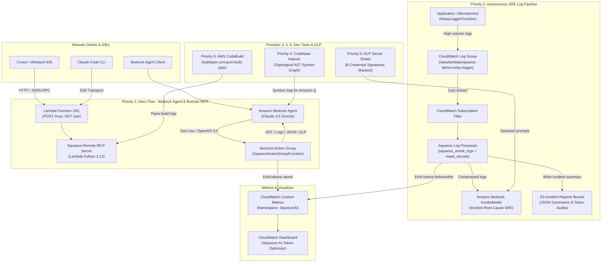
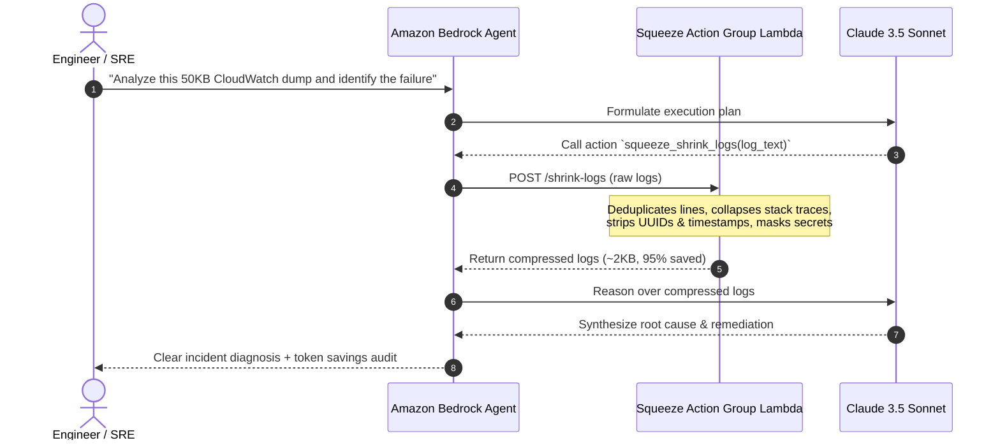

# 🏛️ Squeeze AI on AWS — Architecture Documentation

Squeeze is a universal LLM context compressor that cuts token consumption by **80–95%**, dedupes repetitive logs and API payloads, extracts AST code skeletons, enforces in-flight DLP credential masking, and optimizes KV-cache hits.

This document details the architectural design and data flows across all 6 AWS integration points.

---

## 1. End-to-End System Architecture

---

## 2. Component Deep-Dive

### Priority 1: Bedrock Agent with Squeeze as an MCP Tool (Hero Flow)
* **Problem**: When a Bedrock Agent investigates production issues or reviews code, injecting raw logs or full source files consumes tens of thousands of tokens, increases latency, and quickly exhausts the context window.
* **Solution**:
  1. An Amazon Bedrock Agent is configured with an **Action Group** backed by an OpenAPI 3.0 schema mapping Squeeze's context compression tools (`squeeze_shrink_logs`, `squeeze_shrink_json`, `squeeze_skeleton`, `squeeze_compress`, `squeeze_codebase_graph`, `squeeze_retrieve`).
  2. When asked to inspect a raw payload, Bedrock Agent's orchestration planner detects the tool requirement and triggers the Squeeze Action Group.
  3. Squeeze deduplicates identical log lines, folds JSON arrays, strips boilerplate, and returns an 85% smaller payload.
  4. The agent completes reasoning in seconds rather than minutes, saving 80–90% of model inference costs.
  5. In parallel, a **Lambda Function URL** exposes `squeeze_mcp` over HTTP/SSE and JSON-RPC 2.0, allowing external MCP clients (Cursor, Windsurf, Claude Code) to use the exact same AWS endpoint.

---

### Priority 2: Autonomous CloudWatch Logs Pipeline
* **Problem**: High-cardinality cloud logging creates millions of repetitive log lines. Sending raw CloudWatch logs directly to LLMs for automated triage is cost-prohibitive ($100s/day).
* **Solution**:
  1. A **CloudWatch Logs Subscription Filter** intercepts log streams in real-time.
  2. The `SqueezeLogProcessor` Lambda receives gzipped log batches, collapses repeated error messages and tracebacks, and masks leaked credentials.
  3. Custom CloudWatch metrics are emitted to the `SqueezeAI` namespace (`TokensBefore`, `TokensAfter`, `TokensSaved`, `EstimatedCostSavedUSD`).
  4. The compressed log is passed to Amazon Bedrock (`bedrock-runtime:invoke_model`), which generates a concise incident summary.
  5. The final triage report is archived in an **S3 Incident Reports Bucket** with an automated lifecycle policy.

---

### Priority 3: CI Log Compression for AWS CodeBuild
* **Problem**: Complex CI/CD builds (Cargo, Maven, npm test) output thousands of lines of verbose compilation logs. When a build fails, piping the raw log to an LLM triager causes context overflow.
* **Solution**:
  1. A `buildspec.yml` `post_build` phase pipes raw build logs through Squeeze CLI.
  2. Repetitive compiler progress warnings and identical retry lines are collapsed.
  3. The resulting ~500-token summary is sent to Bedrock Haiku/Sonnet via `triage_build_failure.py` for instantaneous PR triage comments.

---

### Priority 4: Codebase Topological Graph & AST Indexer
* **Problem**: Coding assistants like Amazon Q Developer or IDE agents often fetch dozens of full files just to locate where a single interface or class is defined.
* **Solution**:
  1. An API Gateway endpoint (`POST /index-repo`) receives a GitHub repository URL or zip.
  2. In `/tmp`, Squeeze parses source files (Python, TypeScript, JS, Go, Rust), computes **in-degree centrality import rankings**, and extracts AST structural skeletons (`class`, `def`, `interface` signatures without function bodies).
  3. Returns a compact markdown map that agents can use to navigate codebases with **zero file-reading exploration cost**.

---

### Priority 5: DLP Secret Shield (Compliance & Data Governance)
* **Problem**: Developers and microservices frequently leak credentials into debug logs and prompts. Sending unmasked credentials to LLM providers violates SOC2, HIPAA, and AWS security best practices.
* **Solution**:
  1. Squeeze runs an in-flight DLP scanner supporting **8 credential signatures**:
     * AWS Access Keys (`AKIA...`) and Secret Keys
     * OpenAI Keys (`sk-proj-...`, `sk-live-...`)
     * Anthropic API Keys (`sk-ant-...`)
     * Google Cloud API Keys (`AIzaSy...`)
     * GitHub Tokens (`ghp_...`, `gho_...`)
     * JSON Web Tokens (`eyJ...`)
     * Database Connection Strings (Postgres, Mongo, MySQL passwords)
  2. Sanitizes sensitive secrets *before* payloads leave the AWS VPC or enter LLM prompts.

---

### Priority 6: X-Ray Traces & DynamoDB Stream Compression (Blueprint)
* **DynamoDB Streams CDC**: Repetitive DynamoDB old/new image records in change-data-capture pipelines are collapsed by `squeeze_shrink_json` before ingestion by LLM monitoring agents.
* **AWS X-Ray Traces**: Verbose distributed trace segments containing duplicate HTTP headers and subsegments are condensed by 80% before LLM anomaly detection.

---

## 3. Cost & Latency Architecture

| Component | Provisioned Compute | Idle Cost | Execution Latency |
|---|---|---|---|
| **Squeeze MCP Server** | AWS Lambda (512MB) + Function URL | **$0.00 / month** | 2–15 ms |
| **Bedrock Action Group** | AWS Lambda (512MB) | **$0.00 / month** | 2–10 ms |
| **Log Processor** | AWS Lambda (512MB) | **$0.00 / month** | 5–25 ms |
| **Incident Reports Store** | Amazon S3 (Standard + 7-day expiry) | < $0.05 / month | Immediate |
| **Metrics & Dashboard** | CloudWatch Custom Dashboard | ~$3.00 / month | Real-time |
| **CodeBuild CI Project** | Linux Small (on-demand per minute) | **$0.00 / month** | Per-build |

> [!NOTE]
> **Total Idle Cost for Entire Stack:** Approximately **$0.00 / month** (excluding optional CloudWatch dashboard metrics charges). All resources can be completely torn down in one command: `./aws/scripts/destroy_all.sh` or `npx cdk destroy --all`.
